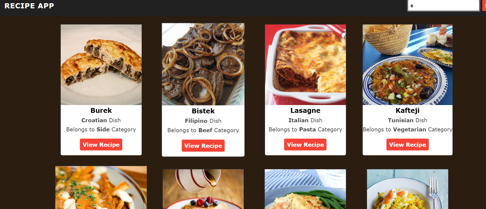

<h1 align="center">JS API 2</h1>

  <h3>
    <a href="https://ande-glitch.github.io/JSAPI2/">
      Link to project
    </a>
  </h3>

<!-- TABLE OF CONTENTS -->

## Table of Contents

- [Overview](#overview)
- [Built With](#built-with)
- [Features](#features)
- [How to use](#how-to-use)
- [Contact](#contact)

<!-- OVERVIEW -->
## Overview
- Vi brukte fetch til å hente data og følgte en YouTube tutorial til å lage en prosjekt.
- Link to video: https://www.youtube.com/watch?v=DkUjwWQEgOE&list=PLMxec9nlD1X0bOU3N1yF9IV4HRpotUa8z&ab_channel=CodeTraversal

## Features
- Recipe menu
- Søk til å få matretter
- Få instruksjoner og ingredienser

## Contact
- GitHub [Ande-Glitch](https://github.com/Ande-glitch)
- Epost [And Nguyen](mailto:andynuwen@gmail.com)

## Result

